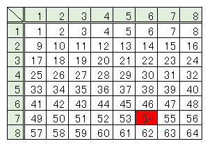

# Q 学習の例題プログラム
Q学習の例題を実際に実装してみて動作を確認する。
## 探索経路がマトリクス
探索経路が非常にシンプルは2分木構造になっている例での実装とします。構造は以下の通り
<p align="center">
<br>
FIG:1 探索の図
</p>


実行は以下コマンドで実行できる。
```bash
$ python3 ./q_larning.py
***
↓←←→↓←→←
←←→↓←→←↓
←→↓←→←↓↑
→↓←→←↓↑↓
↓←→←↓↑↓↓
←→←↓↑↓↓→
→←↓↑↓↓→←
←↓↑↓↓→←→

***
***
↓←←→↓←→←
←←→↓←→←↓
←→↓←→←↓↑
→↓←→←↓↑↓
↓←→←↓↑↓→
←→←↓↑↓→→
→←↓↑↓→→←
←↓↑↓→→←→

***
***
↓←←→↓↓→←
←←→↓↓→←↓
←→↓↓→←↓↑
→↓↓→←↓↑←
↓↓→←↓↑←↓
↓→←↓↑←↓→
→←↓↑←↓→←
←↓↑←↓→←↓

***
→→→↓↓↓↓↓
→→↓↓↓↓↓↓
→↓↓↓↓↓↓↑
↓↓↓↓↓↓↑↑
↓↓↓↓↓↑↑→
↓↓↓↓↑↑→→
↓↓↓↑↑→→↓
↓↓↑↑→→↓↓
```
この例ではゴールの`54`への方向に重みが強いことがわかります。
