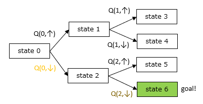
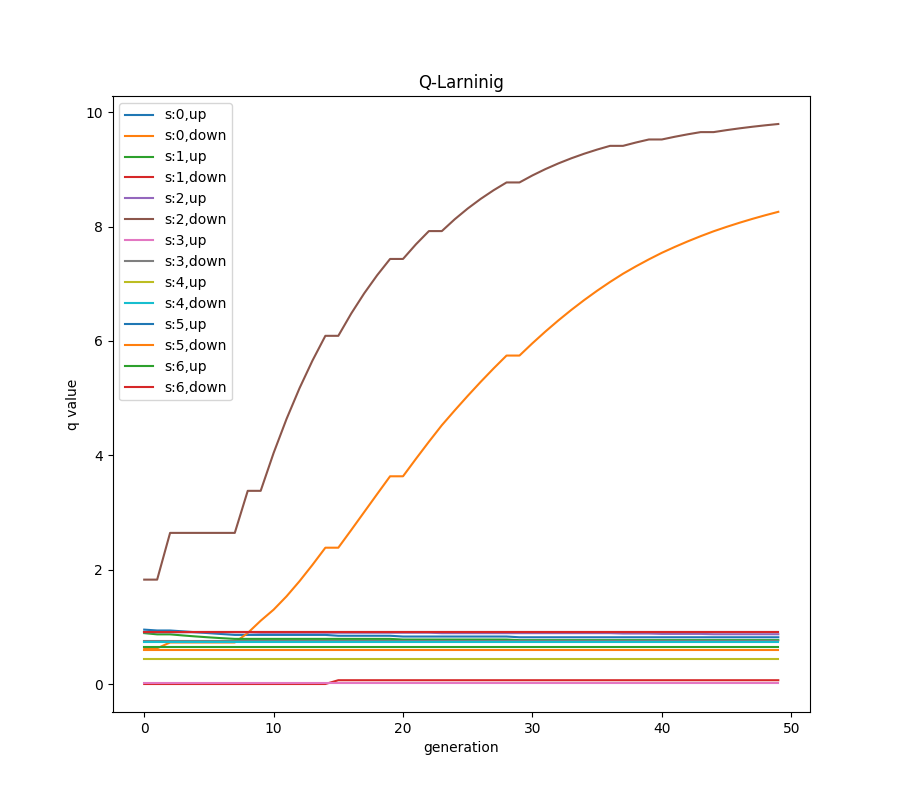

# Q 学習の例題プログラム
Q学習の例題を実際に実装してみて動作を確認する。
## 探索経路が木構造
探索経路が非常にシンプルは2分木構造になっている例での実装とします。構造は以下の通り
<p align="center">
<br>
FIG:1 各Qの値の世代依存性
</p>


実行は以下コマンドで実行できる。
```bash
$ python3 ./q_larning.py
[2020-01-15 11:37:49,917] INFO -- : *** start q_larning ***
[2020-01-15 11:37:49,917] INFO -- : status: 0 action: 0　※1回目
[2020-01-15 11:37:49,917] INFO -- : status: 1 action: 0　※1回目
s:0 ↑: 0.546862212903794 ↓:0.27564993190315845
s:1 ↑: 0.4543549906270138 ↓:0.15778497849900797
s:2 ↑: 0.4798182006207341 ↓:0.5996161210303579
s:3 ↑: 0.563098554400687 ↓:0.5853265318385963
s:4 ↑: 0.49366479306106237 ↓:0.5426969552973885
s:5 ↑: 0.2880857905989116 ↓:0.6348526456132161
s:6 ↑: 0.6808896688518019 ↓:0.9919761781081738
[2020-01-15 11:37:49,917] INFO -- : status: 0 action: 0　※ 2回目
[2020-01-15 11:37:49,917] INFO -- : status: 1 action: 0　※ 2回目
s:0 ↑: 0.5330679407698459 ↓:0.27564993190315845
s:1 ↑: 0.46159887942978606 ↓:0.15778497849900797
s:2 ↑: 0.4798182006207341 ↓:0.5996161210303579
s:3 ↑: 0.563098554400687 ↓:0.5853265318385963
s:4 ↑: 0.49366479306106237 ↓:0.5426969552973885
s:5 ↑: 0.2880857905989116 ↓:0.6348526456132161
s:6 ↑: 0.6808896688518019 ↓:0.9919761781081738
[2020-01-15 11:37:49,917] INFO -- : status: 0 action: 1　※ 3回目
[2020-01-15 11:37:49,918] INFO -- : status: 2 action: 0　※ 3回目
s:0 ↑: 0.5330679407698459 ↓:0.30205038960557484
s:1 ↑: 0.46159887942978606 ↓:0.15778497849900797
s:2 ↑: 0.4889731186638501 ↓:0.5996161210303579
s:3 ↑: 0.563098554400687 ↓:0.5853265318385963
s:4 ↑: 0.49366479306106237 ↓:0.5426969552973885
s:5 ↑: 0.2880857905989116 ↓:0.6348526456132161
s:6 ↑: 0.6808896688518019 ↓:0.9919761781081738
[2020-01-15 11:50:26,389] INFO -- : status: 0 action: 1　※最後
[2020-01-15 11:50:26,389] INFO -- : status: 2 action: 1　※最後
s:0 ↑: 0.36335288740674954 ↓:8.505309881080922
s:1 ↑: 0.030176568364239764 ↓:0.6858172781552573
s:2 ↑: 0.6713406663364205 ↓:9.873547802553285
s:3 ↑: 0.6643009508552851 ↓:0.7641010476613381
s:4 ↑: 0.5428032285337466 ↓:0.49252105248514766
s:5 ↑: 0.4106370508564007 ↓:0.9558581044067725
s:6 ↑: 0.5777755162042985 ↓:0.5741268244882954

```
この例では世代を繰り返すごとに正解に近づいている様子がわかります。
```
status(0) →  up ↑ →　status(1) →　up ↑ → status(3)  
status(0) →  up ↑ →　status(1) →　up ↑ → status(3)  
status(0) →  down ↓ →　status(2) →　up ↑ → status(5)  
status(0) →  down ↓ →　status(2) →　 down ↓ → status(6) ・・・goal  
```
各Qの値の世代依存性を見ると以下のようになっています。
<p align="center">
<br>
FIG:2 各Qの値の世代依存性
</p>
Q(1,down),Q(2,down)の値が世代を進むに従って増えているのがわかります。また最初にゴールの直近のQ(2,down)が増えて遅れてQ(1,down)が増加している点も注目です。

